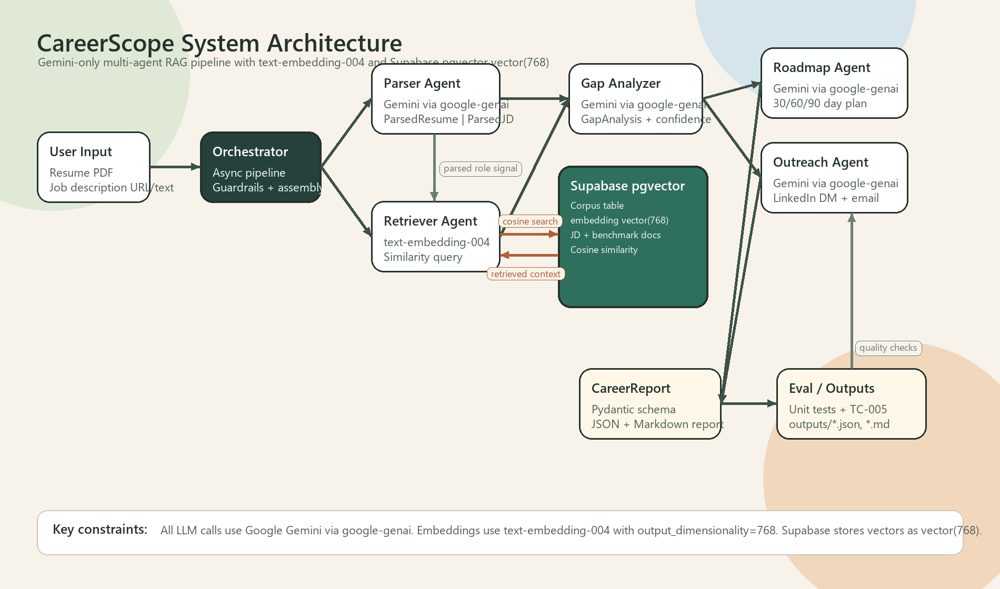

# CareerScope


CareerScope is a multi-agent AI system that analyzes your resume against any job description and returns evidence-based gap analysis, 30/60/90-day roadmap, and recruiter-ready outreach drafts.

## Demo

> [Watch the full demo walkthrough](LOOM_LINK_HERE)

Screenshot/GIF placeholder:


## Base Project

CareerScope extends **PawPal+**, the CodePath AI110 Module 1-3 base project. PawPal+ introduced the core applied-AI workflow: structured prompting, tool-backed retrieval, multi-step orchestration, and responsible model output handling. Its original goal was to demonstrate how an AI assistant can combine user input, domain context, and generated recommendations into a useful end-to-end experience.

CareerScope adapts that foundation for career intelligence. Instead of pet-care planning, the system analyzes a candidate resume and target job description, retrieves similar role and benchmark context, identifies evidence-backed skill gaps, builds a 30/60/90-day plan, and produces concise outreach drafts tailored to the role.

## Architecture Overview



CareerScope uses a FastAPI backend and a Next.js 14 frontend direction, with Railway planned for backend deployment and Vercel planned for the web UI. The current runnable entry point is the CLI orchestrator in `main.py`.

Data flow:

1. The user provides a resume PDF and either a job description URL or raw job description text.
2. `ParserAgent` extracts resume text with `pdfplumber`, fetches or cleans the job description, and asks Gemini to return validated Pydantic objects.
3. `RetrieverAgent` embeds the target role query with Gemini `text-embedding-004` at 768 dimensions, then searches Supabase pgvector `vector(768)` rows for similar job descriptions and benchmark documents.
4. `GapAnalyzerAgent` compares parsed resume evidence, parsed job requirements, and retrieved context to produce a structured match score, strengths, critical gaps, and evidence strings.
5. `RoadmapAgent` converts the gaps into a specific 30/60/90-day plan and two portfolio project ideas.
6. `OutreachAgent` creates a LinkedIn DM and cold email draft while enforcing length, tone, and anti-generic-output guardrails.
7. `CareerScopeOrchestrator` writes both JSON and Markdown reports to the output directory.

## Setup

### 1. Clone the Repository

```bash
git clone <YOUR_REPO_URL>
cd applied-ai-system-project
```

### 2. Create a Virtual Environment

```bash
python -m venv .venv
source .venv/bin/activate
```

On Windows PowerShell:

```powershell
python -m venv .venv
.\.venv\Scripts\Activate.ps1
```

### 3. Install Dependencies

```bash
pip install -r requirements.txt
```

### 4. Configure Environment Variables

Create `.env` from `.env.example`:

```bash
cp .env.example .env
```

Required values:

```env
GEMINI_API_KEY=your_gemini_key_here
SUPABASE_URL=your_supabase_url
SUPABASE_ANON_KEY=your_anon_key
SUPABASE_SERVICE_ROLE_KEY=your_service_role_key
```

CareerScope uses Google Gemini through `google-genai` only. Generation defaults to Gemini 2.0 Flash variants, and embeddings use `text-embedding-004` with `output_dimensionality=768`.

### 5. Set Up Supabase pgvector

Run this SQL in the Supabase SQL editor:

```sql
create extension if not exists vector;

create table if not exists public.corpus (
  id uuid primary key default gen_random_uuid(),
  content text not null,
  embedding vector(768) not null,
  source_file text,
  doc_type text not null check (doc_type in ('jd', 'benchmark')),
  metadata jsonb not null default '{}'::jsonb,
  created_at timestamptz not null default now()
);

create unique index if not exists corpus_source_doc_content_idx
  on public.corpus (source_file, doc_type, md5(content));

create index if not exists corpus_embedding_ivfflat_idx
  on public.corpus using ivfflat (embedding vector_cosine_ops)
  with (lists = 100);

create or replace function public.match_corpus(
  query_embedding vector(768),
  match_doc_type text,
  match_count int default 5
)
returns table (
  content text,
  similarity_score float,
  source_file text,
  doc_type text,
  metadata jsonb
)
language sql
stable
as $$
  select
    corpus.content,
    1 - (corpus.embedding <=> query_embedding) as similarity_score,
    corpus.source_file,
    corpus.doc_type,
    corpus.metadata
  from public.corpus
  where corpus.doc_type = match_doc_type
  order by corpus.embedding <=> query_embedding
  limit match_count;
$$;
```

### 6. Seed the Corpus

Place `.txt` files in:

- `data/jds/` for job descriptions
- `data/benchmarks/` for benchmark resumes or role expectations

Then run:

```bash
python scripts/seed_corpus.py
```

The seed script chunks documents, embeds each chunk with Gemini `text-embedding-004`, validates 768-dimensional vectors, and upserts rows into Supabase.

### 7. Run the CLI

With raw job description text:

```bash
python main.py --resume data/test_fixtures/resumes/entry_swe.pdf --jd-text "Software Engineer role requiring Python, FastAPI, PostgreSQL, React, and production API experience."
```

With a job description URL:

```bash
python main.py --resume path/to/resume.pdf --jd https://example.com/job-posting --output-dir outputs
```

Reports are written as timestamped JSON and Markdown files in `outputs/`.

## Sample Interactions

### 1. Gap Analysis Snippet

```text
Match score: 68%

Critical gaps:
- PostgreSQL: partial - Resume mentions SQL coursework, but does not show production schema design, query optimization, or migrations.
- FastAPI: missing - Target role requires FastAPI experience; resume lists Flask and Python projects but no FastAPI evidence.
- Cloud deployment: partial - Resume includes a Vercel-hosted frontend, but no backend deployment or observability details.
```

### 2. 30/60/90-Day Roadmap Snippet

```text
30 days:
- Build a FastAPI CRUD service with PostgreSQL, Alembic migrations, request validation, and pytest coverage.

60 days:
- Add Supabase Auth and pgvector search to the service, then document API design decisions in the README.

90 days:
- Deploy the backend on Railway, connect it to a Next.js 14 frontend on Vercel, and prepare a role-specific technical walkthrough.
```

### 3. Recruiter Outreach Snippet

```text
LinkedIn DM:
Hi Maya, I saw your team is hiring for a Software Engineer focused on backend APIs and data workflows. I recently built a Python/Supabase project with tested service layers and would value 10 minutes of advice on the role.

Cold email subject:
Software Engineer candidate with Python + Supabase project experience

Cold email body:
Maya, your Software Engineer role stood out because it combines API development, data modeling, and product-facing execution. My recent project, CareerScope, uses Python, Supabase pgvector, structured Pydantic models, and a multi-agent workflow to generate career reports from resumes and job descriptions. I am currently strengthening FastAPI deployment depth, but I can already speak concretely about backend design, retrieval quality, and testing tradeoffs. Would you be open to a short conversation or pointing me to the right person for this role?
```

## Design Decisions

- **Supabase over ChromaDB:** Supabase gives CareerScope managed Postgres, pgvector search, SQL visibility, deployment-friendly persistence, and a path to auth/storage integration in one platform. ChromaDB is useful for local experimentation, but Supabase better matches an employer-facing, deployable product.
- **Gemini SDK direct over LangChain:** CareerScope calls Gemini directly through `google-genai` to keep prompts, response schemas, retries, and token behavior explicit. This reduces abstraction overhead and makes debugging easier for a small multi-agent system.
- **Pydantic inter-agent communication:** Each agent returns typed Pydantic models, so downstream agents receive validated structures instead of loose text. This keeps the parser, retriever, analyzer, roadmap, and outreach steps contract-driven.
- **Gemini, not Anthropic:** The project standardizes on Google Gemini for generation and embeddings. It does not use Anthropic models, OpenAI models, or LangChain in the implementation.

## Testing

Current local result:

```text
pytest -q
.......                                                                  [100%]
7 passed in 0.13s
```

The unit tests cover parser behavior, retrieval helpers, gap analysis validation, and orchestrator report writing with mocked agent calls. The evaluation harness in `eval/eval_harness.py` is a placeholder until a real seeded corpus and live Gemini/Supabase run are available for repeatable quality metrics.

## Reflection

See `model_card.md` for the project reflection, model-use notes, limitations, and responsible AI considerations.

## License

MIT
